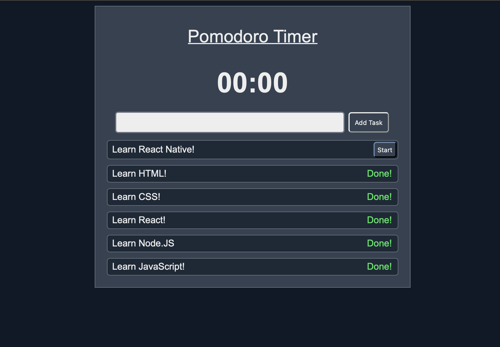
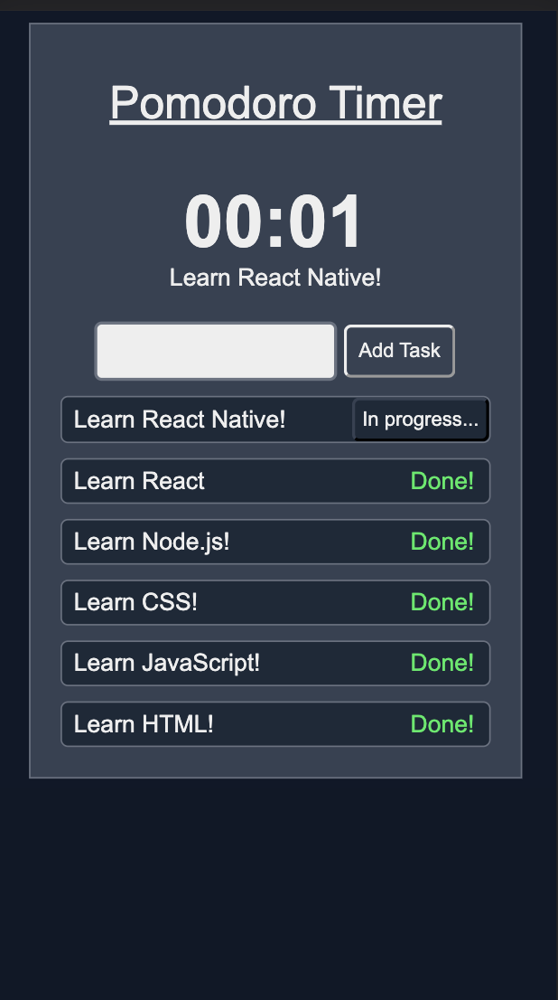

# Pomodoro-Timer

## Objetivos del Proyecto

The Pomodoro technique consists of dividing the time spent studying into 25-minute intervals called pomodoros. These intervals are separated by pauses that also have a fixed duration.

When the first pomodoro ends, you can rest for 5 minutes, then you should continue studying and when you reach the end of the fourth pomodoro you can take another 15-minute break. In this last break it is advisable to walk, move away from the computer and do any kind of short activity.

Applying this technique does not require a great deal of knowledge, just a visible watch and commitment to effectively meet the stipulated deadlines. If you do this, you will see how time really pays off and you will be able to acquire the desired knowledge effectively.

Translated with www.DeepL.com/Translator (free version)

!

  

!

  

